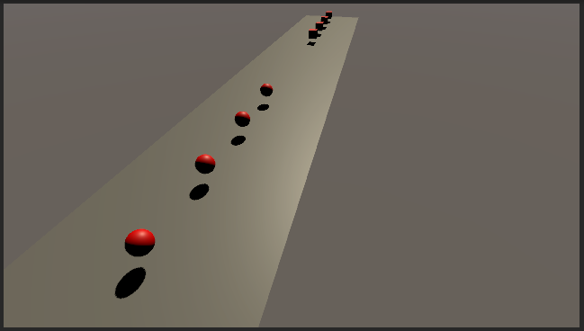
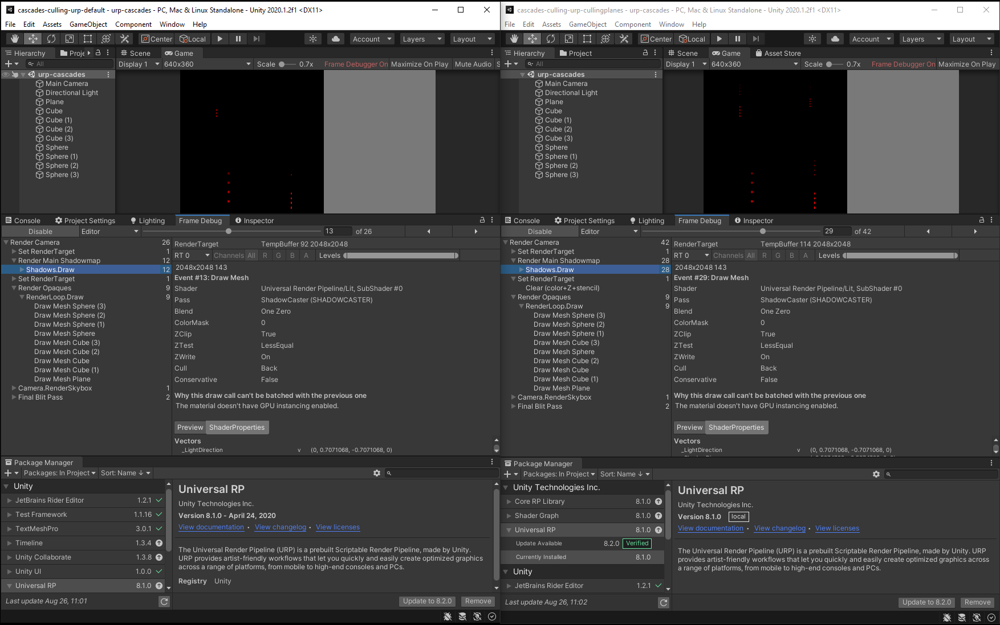
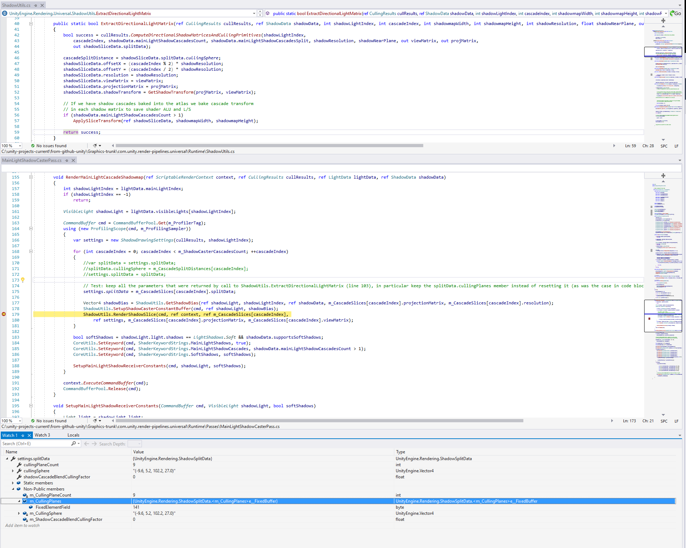

# main-light-shadow-cascades-culling
Test project to investigate main light shadow cascades culling in Unity render pipelines

Illustrates the comment mentioned in https://github.com/Unity-Technologies/Graphics/pull/1616#discussion_r473916172

**Illustration steps**

- Install latest Unity release 2020.1.2f1
- Open reference project [cascades-culling-urp-default](/cascades-culling-urp-default) (uses URP package release 8.0.1)

The test contains 8 shadow casters (4 cubes, 4 spheres) spread along the 4 cascades slices of a DIrectional Light:

- Open test project [cascades-culling-urp-cullingplanes](/cascades-culling-urp-cullingplanes), a copy of the reference project, that instead uses modified URP package from https://github.com/Wilfrid-Unity/Graphics/commits/test-use-main-light-shadow-culling-planes .

*Be careful that currently Package Manager fails to download packages from repos containing largefiles, so until this is fixed you have to locally checkout that [modified URP fork/branch](https://github.com/Wilfrid-Unity/Graphics/commits/test-use-main-light-shadow-culling-planes), and modify file [cascades-culling-urp-cullingplanes/Packages/manifest.json](cascades-culling-urp-cullingplanes/Packages/manifest.json) to make it use this local version of URP package.*

- Open Frame Debugger in both projects 

In reference scene, only 12 shadow casters are rendered in the shadow map.  
In the test scene, that uses a version of URP modified to keep the [ShadowSplitData](https://docs.unity3d.com/2020.1/Documentation/ScriptReference/Rendering.ShadowSplitData.html) culling planes returned from [CullingResults.ComputeDirectionalShadowMatricesAndCullingPrimitives](https://docs.unity3d.com/2020.1/Documentation/ScriptReference/Rendering.CullingResults.ComputeDirectionalShadowMatricesAndCullingPrimitives.html), and later pass them to [ScriptableRenderContext.DrawShadows](https://docs.unity3d.com/2020.1/Documentation/ScriptReference/Rendering.ScriptableRenderContext.DrawShadows.html), 28 shadow casters are rendered in the shadow map.

- Optionally Check the values passed with the culling planes

Attach managed debugger and place a breakpoint at the following location to verify that in the test version of URP package, the ShadowSplitData object passed to does contain culling planes information:

